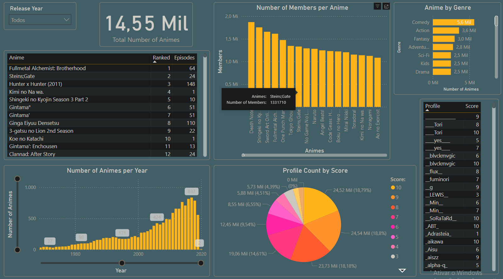

<h1 align="center"> MyAnimeList DataSet </h1>

## Objetivo do Projeto

- Desenvolver um processo que inclua a extração de um conjunto de dados utilizando Python, o tratamento desses dados e seu armazenamento em um banco de dados relacional (Oracle), configurado para operar como um Data Lake. Em seguida, realizar o ETL (extração, transformação e carga) dos dados tratados, utilizando o Visual Studio para transferi-los para um banco de dados relacional (SQL Server), configurado como um banco de dados operacional (produção). Por fim, utilizar o Power BI para visualizar e analisar esses dados.

## Etapas do Projeto

### Extração de Dados com Python

- Utilizar Python para conectar a API do Kaggle e utilizar o Dataset Anime Dataset with Reviews - MyAnimeList ([link aqui](./https://www.kaggle.com/datasets/marlesson/myanimelist-dataset-animes-profiles-reviews)) para realizar a inserção dos dados no banco de dados Oracle (configurado para operar como um Data Lake).

  * Scripts utilizados nessa etapa: ([Python](./Scripts_Base_DL))

### Tratamento de Dados

- Realizar a limpeza e transformação dos dados para garantir qualidade e consistência, incluindo a remoção de duplicatas, a normalização de nomes e a aplicação das formas normais do banco de dados, entre outras práticas. Essas ações deverão ser executadas por meio de objetos no banco de dados, com o objetivo de organizar e aplicar os tratamentos necessários aos dados.

   * Scripts utilizados nessa etapa: ([PL/SQL](./Scripts_Base_DL))

### ETL
 
- Criar tabelas no banco de dados SQL Server para armazenar informações que serão utilizadas pelo Power BI na análise dos dados.
- Executar o processo de ETL (extração, transformação e carga) entre as bases de dados Oracle e SQL Server utilizando o Visual Studio.

   * Scripts utilizados nessa etapa: ([ETL](./Scripts_Base_DL))
 
### Desenvolvimento de Relatórios no Power BI

- Estabelecer a conexão do Power BI com o banco de dados relacional para importar os dados dos animes.
- Desenvolver dashboards no Power BI para analisar e explorar os dados, o que pode incluir a criação de gráficos de barras, gráficos de dispersão, tabelas dinâmicas, entre outros recursos.

<h3> Preview do Dashboard </h3>
  

 
### Análise de Dados e Insights

- Aproveitar as funcionalidades de análise do Power BI para identificar padrões, tendências e insights sobre os animes, incluindo, por exemplo, a análise da popularidade, a distribuição por gênero e as correlações entre os animes.

## Tecnologias Utilizadas

- **Python:** Para a integração da API com a fonte de dados, tratamento de dados e integração com o banco de dados.
- **Banco de Dados Relacional:** Oracle e SQLServer para armazenamento dos dados.
- **ETL:** Visual Studio
- **Power BI:** Para desenvolvimento do Dashboard e análise de dados.

## Intuito do Projeto

Com este projeto, quero demonstrar minhas habilidades em desenvolvimento em Python, linguagem PL-SQL e T-SQL e visualização e análise de dados com o Power BI. Mostrando uma solução completa e integrada que aborda diferentes aspectos do ciclo de vida dos dados.
