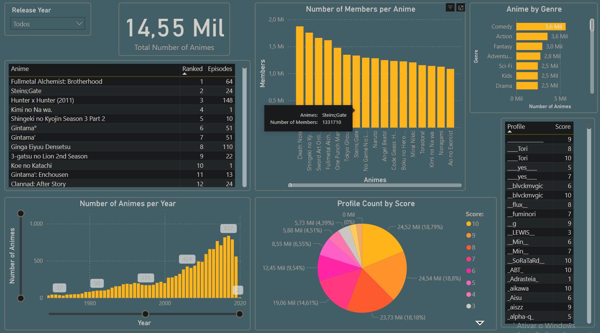

<h1 align="center"> MyAnimeList DataSet </h1>

  
  
  
  
  

---

## 🎯 Objetivo do Projeto  

Desenvolver um processo que inclua:  

- Extração de um conjunto de dados utilizando **Python**  
- Tratamento e armazenamento no **Oracle** (Data Lake)  
- ETL (extração, transformação e carga) para o **SQL Server** (produção) usando **Visual Studio**  
- Visualização e análise dos dados no **Power BI**

---

## 🚀 Intuito do Projeto  

Este projeto visa evidenciar competências em:  

- Programação em **Python**  
- Linguagens **PL-SQL** e **T-SQL**  
- Implementação de processos **ETL** (com SSIS no Visual Studio)  
- **Visualização e análise de dados** com Power BI  

O objetivo é apresentar uma solução integrada que cobre diversos aspectos do **ciclo de vida dos dados**.  

---

## 🛠️ Tecnologias Utilizadas  

- **Python:** Integração com API, tratamento e inserção de dados  
- **Oracle & SQL Server:** Armazenamento dos dados (Data Lake e Produção)  
- **ETL (SSIS – Visual Studio):** Integração entre bases Oracle e SQL Server  
- **Power BI:** Dashboards interativos e análises  

---

## 📌 Etapas do Projeto  

### 🔹 Extração de Dados com Python  

- Conexão à API do Kaggle  
- Utilização do dataset: [Anime Dataset with Reviews - MyAnimeList](https://www.kaggle.com/datasets/marlesson/myanimelist-dataset-animes-profiles-reviews)  
- Inserção no banco Oracle (Data Lake)  

📂 [Scripts Python](./Scripts_Python)  

---

### 🔹 Tratamento de Dados  

- Limpeza e transformação dos dados  
- Remoção de duplicatas  
- Normalização de nomes  
- Aplicação de formas normais no banco  

📂 [Scripts PL/SQL](./Scripts_PLSQL)  

---

### 🔹 ETL  

- Criação de tabelas no SQL Server  
- Processo de ETL entre Oracle → SQL Server (via SSIS no Visual Studio)  

📂 [Projeto ETL](./ETL_SSIS/Animes)  
📂 [Fluxograma do ETL](./ETL_SSIS/Fluxograma_ETL)  

---

### 🔹 Relatórios no Power BI  

- Conexão com SQL Server  
- Criação de dashboards interativos (gráficos, dispersões, tabelas dinâmicas etc.)  

  <h3>📊 Preview do Dashboard</h3>
  

  

---

## 🔎 Análises e Insights  

Com o Power BI foi possível explorar pontos como:  

- Popularidade dos animes  
- Distribuição por gênero  
- Correlações e padrões nos dados  

---
